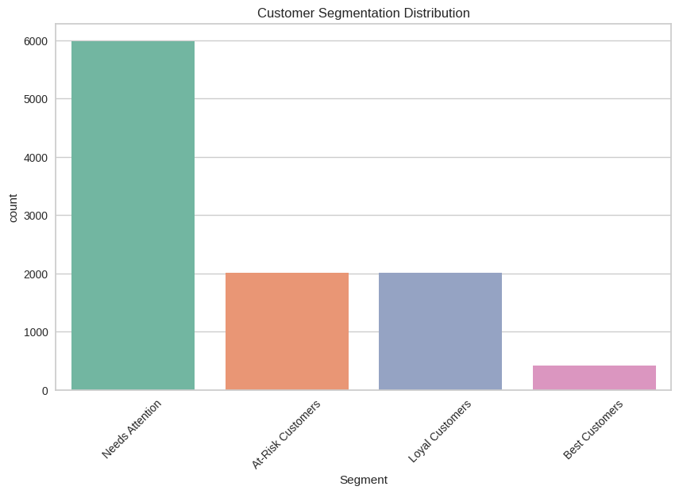
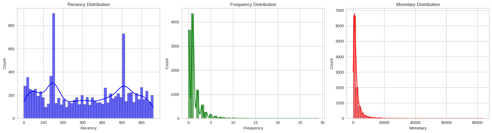
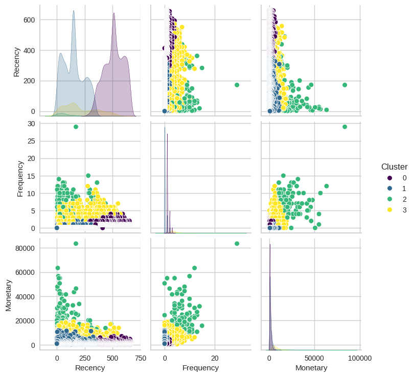
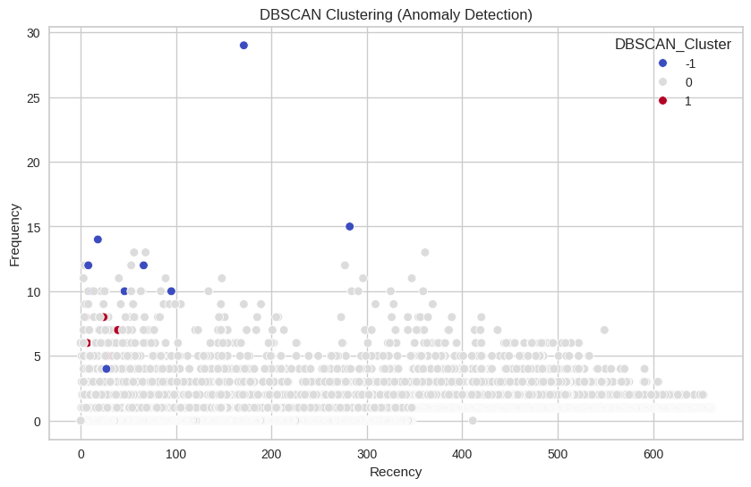

# 🛒 RFM Customer Segmentation – eCommerce Orders Analysis

This project leverages the **RFM (Recency, Frequency, Monetary)** model to perform customer segmentation using an eCommerce dataset. The goal is to identify distinct customer groups based on purchasing behavior and help businesses tailor marketing strategies for each segment.

 <!-- Add your segmentation chart here -->

---

## 📦 Dataset

- **Source**: Kaggle
- **Records**: 30,000+ transactions
- **Fields Used**: `user_id`, `created_at`, `total`, `order_id`

---

## 🔍 Project Highlights

- Cleaned and preprocessed the transactional dataset (date conversion, null handling)
- Calculated **RFM scores**:
  - **Recency**: Days since last purchase
  - **Frequency**: Number of orders
  - **Monetary**: Total spend
- Assigned RFM score segments using quantiles
- Created customer clusters using **KMeans** clustering
- Visualized clusters with count plots and spending distributions

---

## 🔢 RFM Table Sample

| Customer | Recency | Frequency | Monetary | RFM Score | Segment     |
|----------|---------|-----------|----------|-----------|-------------|
| 7337     | 12      | 5         | \$1520   | 444       | Champions   |
| 4868     | 89      | 1         | \$1771   | 211       | New Customers |
| 4337     | 37      | 3         | \$2567   | 332       | Potential Loyalists |

---

## 🧰 Tech Stack

- **Python 3**
- `pandas`, `datetime`, `seaborn`, `matplotlib`
- `sklearn` (for KMeans clustering)
- `numpy`

---

## 📈 Visualizations

- RFM distribution histograms

- Elbow Method & Silhouette Score Analysis

- Customer clusters based on RFM scores

- DBSCAN Clustering (Anomaly Detection)



---

## 🧪 How to Run the Notebook

1. Clone the repo:
```bash
git clone https://github.com/yashling/Ecommerce-RFM-Segmentation.git
cd Ecommerce-RFM-Segmentation
jupyter notebook RFM_Customer_Segmentation.ipynb
